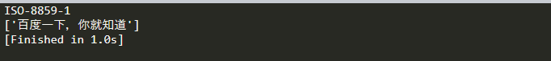

# requests爬取百度中文乱码问题

 1. 方法一

``` python
import requests
from lxml import etree

url = 'https://www.baidu.com'
headers = {
	    'User-Agent': 'Mozilla/5.0 (Windows NT 10.0; Win64; x64) '
	                  'AppleWebKit/537.36 (KHTML, like Gecko) '
	                  'Chrome/75.0.3770.142 Safari/537.36'
	}
resp = requests.get(url=url, headers=headers)
print(resp.encoding)

html = str(resp.content,'utf-8') # 改变其编码
res_xpath = etree.HTML(html)
rst = res_xpath.xpath('//title/text()')
print(rst)
```



 1. 方法二

``` python
import requests
from lxml import etree

url = 'https://www.baidu.com'
headers = {
	    'User-Agent': 'Mozilla/5.0 (Windows NT 10.0; Win64; x64) '
	                  'AppleWebKit/537.36 (KHTML, like Gecko) '
	                  'Chrome/75.0.3770.142 Safari/537.36'
	}
resp = requests.get(url=url, headers=headers)
print(resp.encoding)
resp.encoding = 'utf-8' # 改变编码
res_xpath = etree.HTML(resp.text)
rst = res_xpath.xpath('//title/text()')
print(rst)
```


参考链接：
[Python模块Requests的中文乱码问题](https://www.cnblogs.com/sheng-247/p/7686014.html)