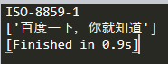

##解决requests爬取百度中文乱码问题

####方法一
```
import requests
from lxml import etree

url = 'https://www.baidu.com'
headers = {
        'User-Agent': 'Mozilla/5.0 (Windows NT 10.0; Win64; x64) '
	                  'AppleWebKit/537.36 (KHTML, like Gecko) '
	                  'Chrome/75.0.3770.142 Safari/537.36'
	}
resp = requests.get(url=url, headers=headers)
print(resp.encoding) # 打印reauests默认解码方式
html = str(resp.content,'utf-8')
res_xpath = etree.HTML(html)
rst = res_xpath.xpath('//title/text()')
print(rst)
```

可以看到默认