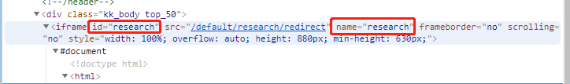

## 自动化测试之那些遇到的坑
**1. Selenium定位不到指定元素原因之iframe（unable to locate element）**

项目原因：在模拟打开网易云音乐网站搜索“以为”并播放第一首歌时，发现播放不了。
sublime报错unable to locate element无法定位元素。

从上一个页面转到下一个页面时点击指定元素无反应，原错误代码如下：
		

``` python
from selenium import webdriver
from time import sleep

driver = webdriver.Chrome()
driver.get('https://music.163.com/')
driver.find_element_by_id('srch').send_keys('以为\n')
driver.find_element_by_css_selector('#song_1347652342').click()
element = driver.find_element_by_css_selector('#song_1347652342')
print(element.get_attribute("outerHTML"))
sleep(10)
driver.quit() #释放webdriver进程，结束本次自动化测试
```
以为是自己selector没写对，但是经过反复确认并实验发现并没有错，折腾了一会后，在百度上搜了搜终于得到了结果。

解决方法：只有切换到iframe里面，selenium才能定位到 iframe里面的元素。selenium提供了switch_to.frame()方法来切换frame

``` python
switch_to.frame(reference)
```
switch_to.frame(reference)中的reference是传入的参数，用来定位frame，可以传入id、name、index以及selenium的WebElement对象。如下图中的 id、name。如果没有id、name属性的化，可以通过xpath匹配WebElement对象进行定位。


正确代码为：

``` python
from selenium import webdriver
from time import sleep

driver = webdriver.Chrome()
driver.get('https://music.163.com/')
driver.find_element_by_id('srch').send_keys('以为\n')
driver.switch_to.frame('g_iframe') #切换到下一个页面时，要切换到iframe里面，selenium才能定位到 iframe里面的元素
driver.find_element_by_css_selector('#song_1347652342').click()
element = driver.find_element_by_css_selector('#song_1347652342')
print(element.get_attribute("outerHTML"))
sleep(10)

driver.quit() #释放webdriver进程，结束本次自动化测试
```
参考文章：
1.[Selenium定位不到指定元素原因之iframe（unable to locate element）](https://www.cnblogs.com/bigtreei/p/9974581.html#_label2)
2.[深入理解iframe](https://www.jianshu.com/p/e0d51edbbc62)
